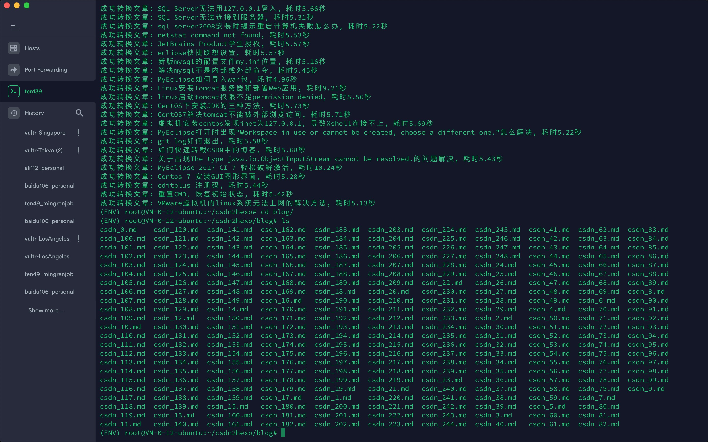

# csdn2hexo

`CSDN` 博客一键迁移至 `Hexo`, 转换成功率高达99%.



## Quick Start

```bash
# 安装依赖
pip3 install -r requirements.txt

# 手动登录获取cookies
python3 csdn_login.py

# 爬取文章信息和转换成md文件
python3 migrate.py

```

## Environment

* requests
* BeautifulSoup4
* lxml
* selenium

## Blog

https://hsowan.me

## License

[MIT](./LICENSE)